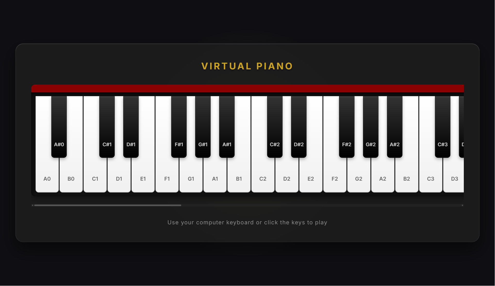

# 🎹 React Piano

An interactive virtual piano built with React.js.  
Play piano notes directly in the browser using mouse clicks or keyboard input — no backend or external API required.

---

## ✨ Features

- 🎵 Interactive piano keys
- ⌨️ Keyboard support
- 🔊 Real-time sound playback
- 📱 Responsive design
- ⚛️ Built with React.js
- 🚫 No backend / No API

---

## 🖼️ Preview



## ⚙️ Installation

Clone this repository:

```bash
git clone https://github.com/Artha444/Virtual-Piano.git
